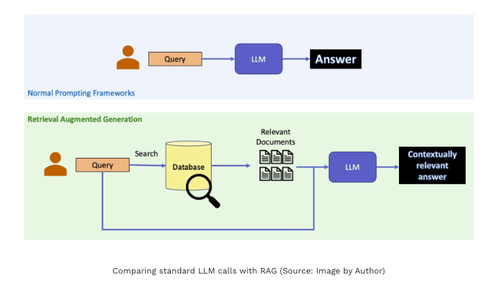
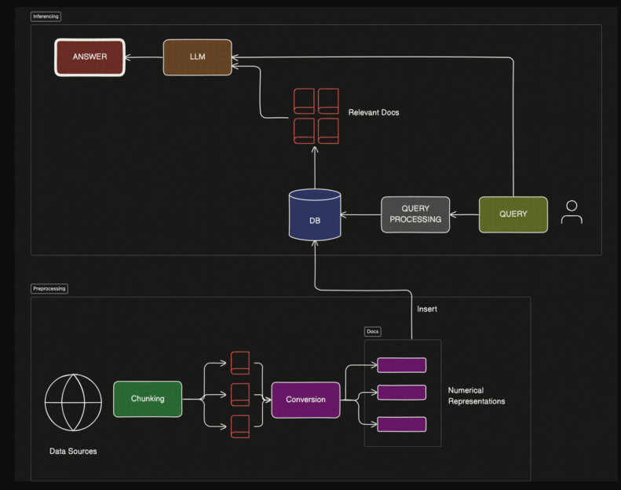
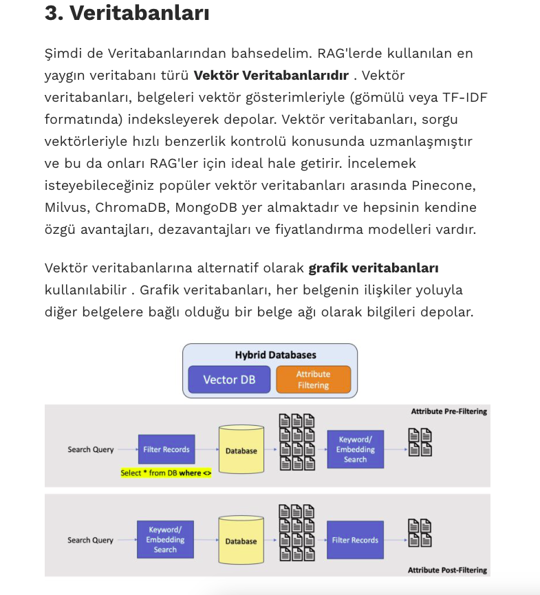
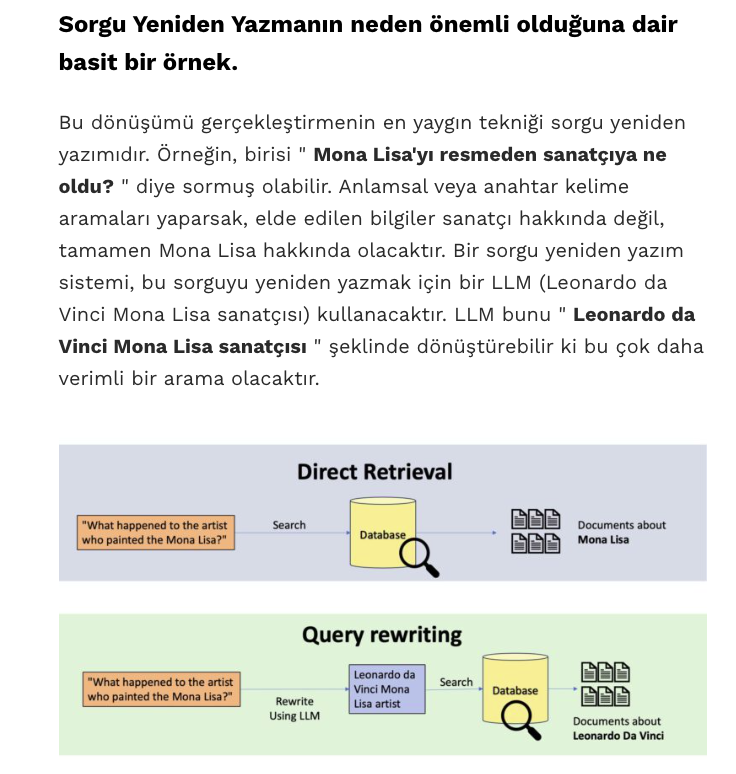
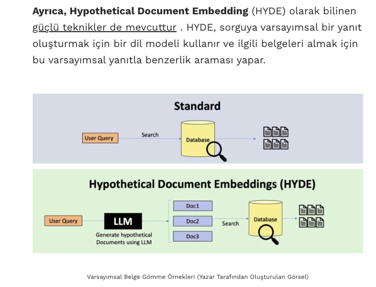

# 🔍 RAG — Retrieval-Augmented Generation

> LLM'lere gerçek zamanlı ve güvenilir bilgi kazandırmanın mimarisi.

---

## Benim Çıkarımım
> RAG'ler AI destekli sorgu ve aramalarda LLM' lerin güncel olamadığı ve kapsam alanına alamadığı verilerin yani daha güncel ve bağlama yakın ama LLM'in sunamayacağı verileri süreç içinde LLM ile paylaştığı ve bu verileri LLM cevabı ike harmanladıktan sonra kullanıcıya daha tutarlı, güncel ve kapsamlı bilgi sunabilmeyi sağlayan bir yöntemdir.

- Özet olarak 
>- RAG yoksa: User Prompt -> LLM search -> Response From LLM
>- RAG varsa: User Prompt [-> RAG ile güncel data kontrolü ve cevap oluşturma] -> Primary Output from RAG + LLM response -> Last Version of Response

Böylece LLM lerin güncel olmayan fakat özgüvenli verdiği yanlış yönlendirme ve cevaplardan RAG lerin güncel veri kontrollerini LLM lerin serach verilerine ekleyip buna göre bağlam çıkarmasını sağlaması ile elde ettiğimiz çıktılar daha tutarlı güvenilir bir hale gelebiliyor. 

## Neden RAG'a İhtiyaç Var?

Büyük dil modelleri (LLM) eğitildikten sonra bilgileri **dondurulur**. Bu iki temel probleme yol açar:

- **Güncellik sorunu** — Model, eğitim tarihinden sonraki olayları bilmez.
- **Halüsinasyon** — Bilmediği konularda güvenle yanlış bilgi üretebilir.

RAG bu problemleri, modele cevap üretmeden önce **dış bir bilgi kaynağından ilgili belgeleri getirerek** çözer.

---

## Temel Mimari

```
📄 Belgeler → [Embedding Modeli] → 🗄️ Vektör DB
                                          ↑
💬 Kullanıcı sorusu                       │ Arama
        ↓                                 │
   [Embedding]  ──── benzerlik araması ───┘
        ↓
   İlgili belgeler çekilir
        ↓
   [LLM] soru + belgeler → ✅ Güvenilir cevap
```



---

## Temel Konseptler

### 1 · Indexleme (Ingestion)

Belgeler sisteme alınmadan önce işlenir. Bu aşama **offline** çalışır; sorgular gelmeden önce tamamlanır.

```
Ham belgeler → Parçalara bölme (Chunking) → Embedding → Vektör DB'ye kaydetme
```

> **Chunking** kritik bir karardır. Parçalar çok küçükse bağlam kaybolur, çok büyükse arama kalitesi düşer.

---

### 2 · Retrieval (Getirme)

Kullanıcının sorusu da bir vektöre çevrilir ve vektör DB'de en yakın belgeler bulunur.

```python
query = "Türkiye'nin nüfusu ne kadar?"
results = vector_db.search(query, top_k=3)  # En ilgili 3 belgeyi getir
```

Yaygın retrieval stratejileri:

| Strateji | Açıklama |
|---|---|
| **Semantic Search** | Anlam tabanlı vektör araması |
| **Keyword Search (BM25)** | Klasik kelime eşleşmesi |
| **Hybrid Search** | İkisinin birleşimi; genellikle en iyi sonucu verir |

---

### 3 · Augmentation (Zenginleştirme)

Bulunan belgeler, kullanıcının sorusuyla birlikte bir **prompt** içinde LLM'e gönderilir.

```
[SYSTEM]
Sen yardımcı bir asistansın. Cevaplarını yalnızca aşağıdaki bağlama dayandır.

[CONTEXT]
<belge_1> ... </belge_1>
<belge_2> ... </belge_2>

[KULLANICI]
Türkiye'nin nüfusu ne kadar?
```

---

### 4 · Generation (Üretme)

LLM, kendisine verilen bağlamı kullanarak cevap üretir. Bağlam dışına çıkması engellenebilir; bu **halüsinasyonu** ciddi ölçüde azaltır.

---

## RAG vs Fine-Tuning

İkisi birbirinin alternatifi değil, tamamlayıcısıdır. Hangisini kullanacağını seçerken:

| | RAG | Fine-Tuning |
|---|---|---|
| **Bilgi güncelleme** | Anlık, kolay | Modeli yeniden eğitmek gerekir |
| **Maliyet** | Düşük | Yüksek |
| **Kaynak gösterme** | Doğal olarak destekler | Desteklemez |
| **Ton/davranış değişikliği** | Zayıf | Güçlü |
| **Ne zaman tercih edilmeli** | Güncel, doğrulanabilir bilgi gerektiğinde | Modelin belirli bir tarzda konuşması gerektiğinde |

---

## Kullanım Alanları

- **Kurumsal soru-cevap** — Şirket dokümanları, politikalar, prosedürler üzerinde akıllı arama
- **Hukuk / Tıp** — Hassas alanlarda kaynak göstererek güvenli cevap üretimi
- **Müşteri desteği** — Bilgi tabanına dayalı otomatik destek botu
- **Kod asistanları** — Güncel kütüphane dokümanlarını baz alarak kod önerisi
- **Araştırma** — Yüzlerce makale arasından ilgili bilgiyi yüzeye çıkarma

---

## Yaygın Kullanılan Araçlar

| Katman | Araçlar |
|---|---|
| **Orchestration** | LangChain, LlamaIndex, Haystack |
| **Vektör DB** | Pinecone, Qdrant, Weaviate, Chroma |
| **Embedding Modeli** | OpenAI `text-embedding-3`, Cohere, BGE |
| **LLM** | GPT-4, Claude, Llama, Mistral |



---

## Özet

```
RAG = Doğru Bilgiyi Bul + LLM ile Anlamlı Cevap Üret
```

LLM'in yaratıcı dil gücünü, vektör veritabanının hızlı ve isabetli aramasıyla birleştiren RAG; halüsinasyonu azaltır, güncelliği garanti eder ve kaynak gösterilebilir cevaplar sunar.

---

*RAG — Retrieval-Augmented Generation · Temel Kavramlar*